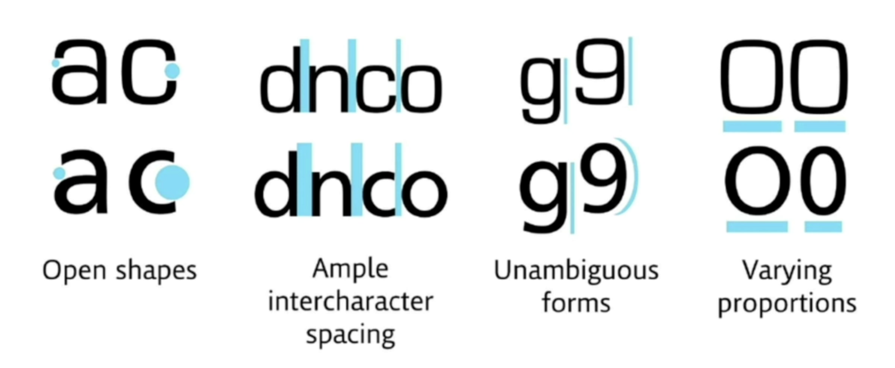

# Web Design School Notes

## Introduction to Web Design

- The four pillars of good web design are:
  - Color Theory
  - Typography
  - User Interface Design
  - User Experience Design

## Understanding Colour Theory

- When picking colours, you need to be AWARE of the MOOD of the colour pallete

- Taking two adjacent colours on the colour wheel is called Analogous colours.
  - These colours are harmonious and work well together.
  - These colour palletes are very good for the naviagtion bar, body of your website, logos and its background.
  - **However, it's not good at standing out**.
- If you want your design to POP, take colours on the opposite ends of the colour wheel, **Complementary Colours**.
  - You shouldn't colour text and text background with complementary colours.
- Another way to combine colours is drawing an equilateral triangle to create **Triadic Colours**.
- You can create a perfect square to create.
- You can mess around with Adobe color to discover different colour palletes.

## Understanding Typography and How to Choose a Font

-  Fonts and the Moods Associated with it

- ### Readability and Legibility is incredibly important!

- Stick to 2 fonts in one design. For example, if you're making a section in your website, keep it to two fonts so that it is cleaner
- The two fonts should have similar **moods** and **time era**.
- However, you should contrast the **serif-ness** (ex: heading - serif, body - sans-serif) and **weights**

## Manage ATTENTION with effective User Interface (UI) Design

- **Hierarchy**
  - Can be established with **colour**
  - Another way is to **size**
- **Layout**  
  - You want to aim for 40-60 characters per line for optimal layout width
- **Alignment**
  - Try to **reduce** the number of alignment points

- **White Space**
  - adding an appropriate amount of whitespace will make the design more minimalist and elevate the overall look
- **Audience**
  - you need to think about your audience and what would appeal to them. You need to know what would be important to them.
  - Be flexible with your design skills

## User Experience (UX) Design

### There are 5 things that need to be thought of:

- Simplicity
- Consistency
- Reading Patterns
  - Common Reading Pattern is called the **F Pattern**
  - F pattern states that the eyes start at the top left corner and go to the right. Then comes back to the top left and reads straight down the page.
  - Therefore, it would be a **good idea to have the most important parts of the layout on the left side of the webpage**

  - Z Pattern is another design pattern to look into when designing 

- All Platform Design
  - Make sure your website rearranges itself depending on what screen/device it is being rendered on
- Don't Use Your Powers for Evil
  - These are called dark patterns.